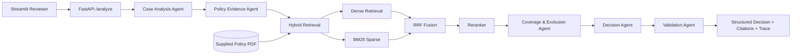

# Aptino AI Engineer Take-Home — Policy-Aware Multi-Agent RAG Claim Decision Engine

A production-style, evidence-grounded claim decision service built around the supplied Universal Sompo policy PDF and the 12 synthetic public cases. It deliberately **abstains instead of guessing** when material evidence is missing.

## What is included

- FastAPI backend: `POST /analyze`, `GET /health`
- Streamlit reviewer UI
- Meaningful policy chunking with page/section/chunk metadata
- Hybrid retrieval:
  - dense semantic vectors (SentenceTransformers when available)
  - local dense latent-semantic fallback using TF-IDF + SVD
  - BM25 sparse retrieval
  - Reciprocal Rank Fusion (RRF)
  - reranking using a CrossEncoder when available, otherwise transparent lexical+dense reranking
- Five genuinely separated agents exchanging structured state
- Citation-aware validation and safe abstention
- All 12 supplied public cases + 5 separately created cases
- Reproducible evaluation script and committed evaluation results
- Unit tests
- Dockerfile and Render deployment blueprint

## Architecture



## Agent boundaries

1. **Case Analysis Agent** — extracts decision facts and creates an investigation checklist.
2. **Policy Evidence Agent** — runs multiple decision-dimension retrieval queries and returns ranked evidence with provenance.
3. **Coverage & Exclusion Agent** — applies policy-grounded waiting periods, scope, exclusions, limits and timing rules.
4. **Decision Agent** — consumes structured specialist state rather than another free-form prompt.
5. **Validation Agent** — verifies that material findings have inspectable policy evidence; failure forces `NEEDS_REVIEW`.

No hidden chain-of-thought is returned. The UI exposes only concise actions, evidence metadata, validation status and timings.

## Retrieval design

Policy text is split on PDF page and meaningful headings rather than arbitrary fixed-size windows. Each chunk retains:

- `chunk_id`
- `page`
- `section`
- `text`

Retrieval performs dense and BM25 searches independently, combines their rankings with RRF, and then reranks candidates. If the optional SentenceTransformers stack is unavailable, the project remains runnable using an explicit local fallback: TF-IDF → SVD dense vectors and a transparent lexical+dense reranker. This makes local reproduction possible on constrained environments while preserving a clear upgrade path.

## Safe decision policy

The implementation is intentionally conservative:

- missing hospital/facility evidence → `NEEDS_REVIEW`
- missing medical-necessity evidence in the supplied reliability scenario → `NEEDS_REVIEW`
- unmet waiting period → `NOT_ADMISSIBLE`
- explicit cosmetic exclusion → `NOT_ADMISSIBLE`
- explicit experimental treatment → `NOT_ADMISSIBLE`
- applicable category caps are calculated and surfaced
- pre/post hospitalization windows are checked
- every material finding carries one or more policy citations

The supplied PDF is the authoritative policy source. No external insurance or medical knowledge is used to invent policy conclusions.

## Key policy rules implemented

The supplied policy supports, among other rules:

- 24-hour hospitalization definition with specified day-care exceptions
- day-care coverage including Eye Surgery and other specified procedures
- normal room expense limit of 1% of Basic Sum Insured per day
- medical practitioner/consultant/surgeon fee limit of 25% of Sum Assured
- medicines/diagnostics/etc. limit of 40% of Sum Insured
- domiciliary aggregate sub-limit of 20% of Basic Sum Insured
- ambulance limit of 1% of Basic Sum Insured or ₹1,000, whichever is less
- pre-hospitalization up to 30 days and post-hospitalization up to 60 days
- 48-month pre-existing disease waiting period, subject to policy portability rules
- 30-day initial waiting period and stated exceptions
- one-year waiting for listed diseases such as cataract, with stated prior-insurer waiver conditions
- cosmetic/aesthetic treatment exclusion
- unproven/experimental treatment exclusion

## Local setup

Python 3.10+ is required.

```bash
python -m venv .venv
# Windows:
.venv\Scripts\activate
# macOS/Linux:
# source .venv/bin/activate

pip install -r requirements.txt
```

The first run may download the SentenceTransformers models. For a minimal/offline-style run, the code automatically falls back to its local dense implementation if those models are unavailable.

### Start API

```bash
uvicorn app.main:app --reload --port 8000
```

Health:
`GET http://localhost:8000/health`

Analyze:
`POST http://localhost:8000/analyze`

Example:

```json
{
  "case_id": "PUB-001",
  "policy_id": "USGIC-CSC-2017-2018",
  "policy_start_date": "2025-01-01",
  "claim_date": "2026-03-14",
  "sum_insured_inr": 500000,
  "continuous_coverage_months": 14,
  "prior_insurer_continuous_years": 0,
  "patient": {"age": 34},
  "hospital": {"name": "Sunrise Multispeciality", "network_provider": true},
  "treatment": {
    "type": "inpatient",
    "admission_hours": 96,
    "diagnosis": "Acute appendicitis",
    "procedure": "Appendectomy",
    "pre_existing": false,
    "experimental": false
  },
  "expenses_inr": {
    "room": 30000,
    "doctor_fees": 30000,
    "medicines_diagnostics": 90000,
    "pre_hospitalization": 5000,
    "post_hospitalization": 7000,
    "ambulance": 1200
  },
  "documents": ["claim_form", "discharge_summary", "itemized_bill", "doctor_prescription"],
  "task": "Determine admissibility and applicable limits."
}
```

### Start frontend

In another terminal:

```bash
streamlit run streamlit_app.py
```

## Evaluation

Run:

```bash
python scripts/evaluate.py
```

This evaluates all 12 public cases and 5 candidate-created cases and writes `evaluation_results.json`.

Current reproducible evaluation in this submission:

| Metric | Result |
|---|---:|
| Cases | 17 |
| Decision accuracy | 100% |
| Citation hit rate | 100% |
| Validation pass rate | 100% |
| Correct abstentions | 3 |

The three abstention cases are `PUB-006`, `PUB-011`, and candidate-created `CUSTOM-003`.

### Expected public outcomes

| Case | Expected |
|---|---|
| PUB-001 | ADMISSIBLE_WITH_LIMITS |
| PUB-002 | NOT_ADMISSIBLE |
| PUB-003 | NOT_ADMISSIBLE |
| PUB-004 | ADMISSIBLE_WITH_LIMITS |
| PUB-005 | ADMISSIBLE |
| PUB-006 | NEEDS_REVIEW |
| PUB-007 | ADMISSIBLE_WITH_LIMITS |
| PUB-008 | NOT_ADMISSIBLE |
| PUB-009 | ADMISSIBLE |
| PUB-010 | ADMISSIBLE |
| PUB-011 | NEEDS_REVIEW |
| PUB-012 | NOT_ADMISSIBLE |

## Failure analysis

See `docs/DESIGN_NOTE.md` for three deliberate reliability failures, their root causes and improvements.

## Deployment

### Docker

```bash
docker build -t aptino-claim-engine .
docker run -p 8000:8000 aptino-claim-engine
```

### Render

`render.yaml` defines a backend web service. A separate Streamlit Community Cloud deployment can point at the same repository and run `streamlit_app.py`.

For a real public submission, deploy the API and UI, then add the URLs to the repository's submission notes. This environment cannot create third-party hosting accounts or publish a GitHub repository on the candidate's behalf.

## Security / production notes

- No credentials are committed.
- Configuration is environment-variable based.
- Input is validated with Pydantic.
- API errors return sanitized exception types rather than stack traces.
- The trace contains no chain-of-thought.
- Synthetic supplied cases are preserved unchanged under `data/public_test_cases.json`.
- Candidate-created cases live separately under `data/generated_cases/`.

## Known limitations

1. Policy arithmetic is implemented for the explicit limits exercised by the supplied assignment; a full production adjudicator would externalize every schedule-specific limit and endorsement.
2. The optional transformer/reranker models require model download/cache in a fresh deployment.
3. The deterministic policy layer intentionally abstains rather than making unsupported medical judgments.
4. A production deployment should add authentication, rate limiting, structured logging, monitoring, and persistent vector indexing.
# Policy-Aware-Multi-Agent-RAG-Claim-Decision-Streamlite

